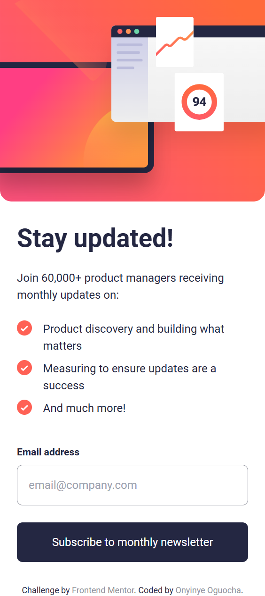

# Frontend Mentor - Newsletter sign-up form with success message solution

This is a solution to the [Newsletter sign-up form with success message challenge on Frontend Mentor](https://www.frontendmentor.io/challenges/newsletter-signup-form-with-success-message-3FC1AZbNrv). Frontend Mentor challenges help you improve your coding skills by building realistic projects.

## Table of contents

- [Overview](#overview)
  - [The challenge](#the-challenge)
  - [Screenshot](#screenshot)
  - [Links](#links)
- [My process](#my-process)
  - [Built with](#built-with)
  - [What I learned](#what-i-learned)
  - [Continued development](#continued-development)
  - [Useful resources](#useful-resources)
- [Author](#author)
- [Acknowledgments](#acknowledgments)

## Overview

### The challenge

Users should be able to:

- Add their email and submit the form
- See a success message with their email after successfully submitting the form
- See form validation messages if:
  - The field is left empty
  - The email address is not formatted correctly
- View the optimal layout for the interface depending on their device's screen size
- See hover and focus states for all interactive elements on the page

### Screenshot





### Links

- Solution URL: [Solution URL here](https://github.com/stephany247/newsletter-sign-up-with-success-message-main/settings/pages)
- Live Site URL: [Live site URL here](https://stephany247.github.io/newsletter-sign-up-with-success-message-main/)


## My process

### Built with

- Semantic HTML5 markup
- CSS custom properties
- Flexbox
- CSS Grid
- [Tailwind CSS](https://tailwindcss.com/docs/installation) - For styles
- JavaScript

### What I learned

Here’s the section filled with actual code from the form project:

What I Learned
Working through this project, I gained a deeper understanding of several key concepts and techniques that helped me improve my front-end skills. Here are some of the major takeaways:

1. Responsive Design with TailwindCSS:
   I enhanced my ability to create responsive layouts using TailwindCSS. By utilizing classes like sm:m-auto, sm:w-full, and sm:flex, I ensured that the layout adjusted seamlessly across different screen sizes.

```html
<body
  class="font-roboto sm:bg-Dark_Slate_Grey text-Dark_Slate_Grey sm:text-sm w-full h-screen m-0 p-0 sm:my-auto sm:flex sm:flex-col sm:place-content-center"
>
  <main
    class="gap-4 bg-white mx-0 max-w-screen-md sm:p-6 sm:m-auto sm:p-auto sm:m-auto sm:rounded-3xl"
  ></main>
</body>
```

2. Form Validation and Error Handling with JavaScript:
   I implemented client-side form validation to ensure users provided accurate information. This taught me how to validate form inputs dynamically and display appropriate error messages.

```js
if (!isValidEmail(emailValue)) {
  emailError.textContent = "Valid email required";
  emailError.classList.remove("hidden");
  emailInput.classList.add("border-tomato");
  emailInput.classList.add("bg-pink-200/50");
  return;
}
```

3. Working with Inputs and Styling Using TailwindCSS:
   I applied TailwindCSS classes to style input fields and buttons for a polished user interface. Using classes like border-gray-300, hover:bg-blue-600, and focus:outline-none, I ensured that the elements were both visually appealing and user-friendly.

```html
<input
  class="border border-Grey p-4 mb-6 rounded-lg focus:border focus:border-Dark_Slate_Grey invalid:border-tomato invalid:text-tomato invalid:bg-pink-200/50 focus:invalid:border focus:invalid:border-pink-500 focus:invalid:border-pink-500"
  type="email"
  name="email"
  id="email"
  placeholder="email@company.com"
/>
```

### Continued development

In future projects, I aim to focus on improving advanced form validation techniques, such as real-time validation, custom error messages, and integrating libraries like Yup or Formik for more efficient handling.

### Useful resources

- [Stack Overflow](https://stackoverflow.com/) - I found helpful solutions for CSS issues, like handling hover effects and box shadows, which were crucial for implementing the card design in this project.

## Author

- Website - [Onyinye Stephanie Oguocha](https://www.your-site.com)
- Frontend Mentor - [stephany247](https://www.frontendmentor.io/profile/stephany247)
- Twitter - [@stephanyoguocha](https://x.com/stephanyoguocha)

## Acknowledgments

I would like to give a big thanks to the Frontend Mentor community and the resources on Stack Overflow for helping me troubleshoot and improve my project.
